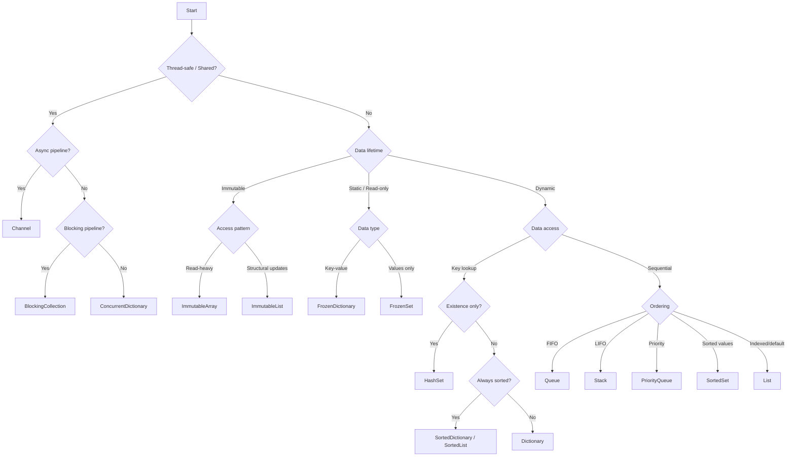

# Practical .NET Collections

A practical, performance-focused guide to choosing the right .NET collection based on real behavior, trade-offs, and measured performance.

---

## How to use this guide

- Use the decision matrix for quick answers
- Use the decision flow when unsure
- Use collection pages for detailed behavior
- Use comparisons and scenarios for trade-offs and real-world usage

---

## Quick Decision Matrix

| Requirement | Use |
|------------|-----|
| Dynamic list of items | `List<T>` |
| Key lookup | `Dictionary<TKey, TValue>` |
| Existence checks | `HashSet<T>` |
| FIFO processing | `Queue<T>` |
| LIFO processing | `Stack<T>` |
| Sorted key-value (dynamic) | `SortedDictionary<TKey, TValue>` |
| Sorted key-value (read-heavy) | `SortedList<TKey, TValue>` |
| Sorted values | `SortedSet<T>` |
| Thread-safe key-value | `ConcurrentDictionary<TKey, TValue>` |
| Async pipeline | `Channel<T>` |
| Blocking pipeline | `BlockingCollection<T>` |
| Immutable read-heavy | `ImmutableArray<T>` |
| Immutable structural updates | `ImmutableList<T>` |
| Static lookup | `FrozenDictionary<TKey, TValue>` |
| Static set | `FrozenSet<T>` |
| Priority processing | `PriorityQueue<TElement, TPriority>` |

---

## Decision Flow

Decision is made in this order:

1. Thread safety
2. Data lifetime (mutable vs immutable vs static)
3. Access pattern (lookup vs sequential)
4. Ordering requirements



---

## Common Mistakes

### Using `List<T>` for frequent lookups

```csharp
// Bad: Forces .NET to scan elements sequentially from start to finish
if (list.Contains(x))
{
    // ...
}
```

Use `HashSet<T>` as a persistent state container created once and reused for lookups.

---

### Modifying `ImmutableArray<T>` inside loops

```csharp
// Bad: Creates a new ImmutableArray instance on every iteration
ImmutableArray<int> items = ImmutableArray<int>.Empty;

foreach (var x in source)
{
    items = items.Add(x);
}
```

Each `Add()` creates a new array instance under the hood.

Use a builder:

```csharp
var builder = ImmutableArray.CreateBuilder<int>();

foreach (var x in source)
{
    builder.Add(x);
}

var items = builder.ToImmutable();
```

---

### Missing capacity

```csharp
var list = new List<T>();
```

Triggers repeated resizing.

Use:

```csharp
var list = new List<T>(N);
```

---

### Struct keys without `IEquatable<T>`

Causes boxing and hidden allocations.

---

## Collections

### Core
- [List](./docs/collections/list.md)
- [LinkedList](./docs/collections/linkedlist.md)
- [Queue](./docs/collections/queue.md)
- [Stack](./docs/collections/stack.md)
- [Dictionary](./docs/collections/dictionary.md)
- [HashSet](./docs/collections/hashset.md)

### Sorted
- [SortedList](./docs/collections/sortedlist.md)
- [SortedDictionary](./docs/collections/sorteddictionary.md)
- [SortedSet](./docs/collections/sortedset.md)

### Concurrent
- [ConcurrentDictionary](./docs/collections/concurrentdictionary.md)
- [ConcurrentQueue](./docs/collections/concurrentqueue.md)
- [ConcurrentStack](./docs/collections/concurrentstack.md)
- [ConcurrentBag](./docs/collections/concurrentbag.md)
- [BlockingCollection](./docs/collections/blockingcollection.md)
- [Channel](./docs/collections/channel.md)

### Immutable
- [ImmutableArray](./docs/collections/immutablearray.md)
- [ImmutableList](./docs/collections/immutablelist.md)
- [ImmutableHashSet](./docs/collections/immutablehashset.md)
- [ImmutableDictionary](./docs/collections/immutabledictionary.md)

### Specialized
- [PriorityQueue](./docs/collections/priorityqueue.md)
- [FrozenDictionary](./docs/collections/frozendictionary.md)
- [FrozenSet](./docs/collections/frozenset.md)
- [BitArray](./docs/collections/bitarray.md)

### Read-only
- [ReadOnlyCollection](./docs/collections/readonlycollection.md)
- [ReadOnlyDictionary](./docs/collections/readonlydictionary.md)

---

## Learn More

- [Comparisons](./docs/comparisons/)
- [Scenarios](./docs/scenarios/)
- [Benchmarks](./benchmarks/)
- [Advanced topics](./docs/advanced/)

---

## Rule of Thumb

- Start with `List<T>` or `Dictionary<TKey, TValue>`
- Preallocate when size is known
- Use `HashSet<T>` immediately for lookup-heavy workloads
